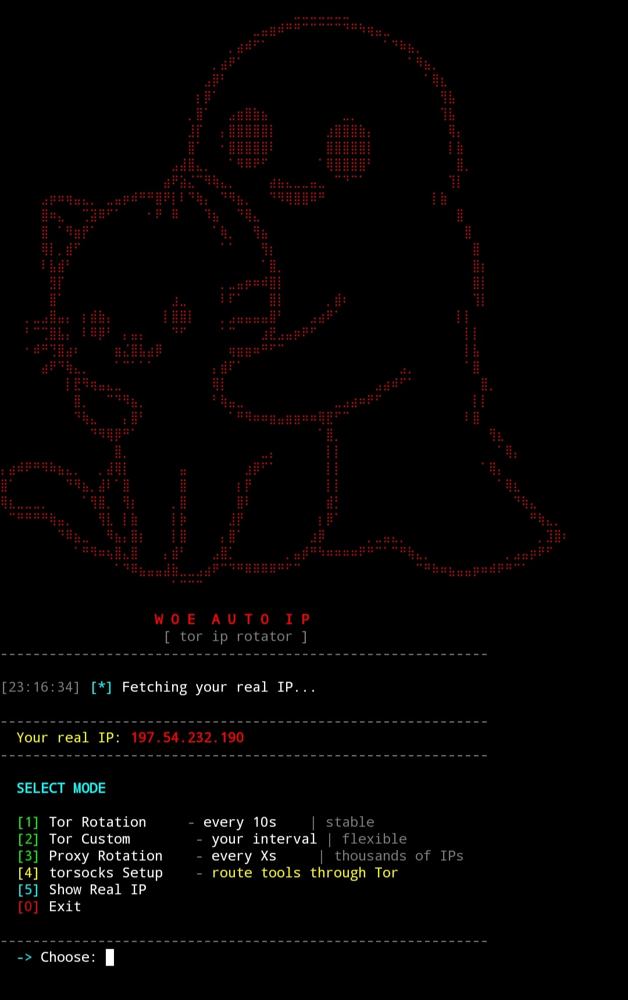

<div align="center">

# ipveil

Automatic IP rotator for Termux — powered by Tor & Proxy




</div>

---

## About

ipveil rotates your IP address automatically using Tor or public proxies.
Built for Termux on Android — no root required.

---

## Features

- Tor IP rotation via HUP signal (same method as anonsurf)
- Public proxy rotation with parallel testing
- Live progress bar with countdown between rotations
- Multi-endpoint IP verification with fallback
- torsocks integration — route any tool through Tor
- Smart retry if IP doesn't change
- Auto-installs Tor if not found

---

## Requirements

```
python 3.8+
tor
curl
torsocks
requests  (pip)
```

---

## Installation

```bash
pkg update && pkg upgrade -y
```
```bash
pkg install python tor curl torsocks git -y
```
```bash
pip install requests
```
```bash
git clone https://github.com/woe0/ipveil
```
```bash
cd ipveil
```
```bash
python ipveil.py
```

---

## Usage

```bash
python ipveil.py
```

```
[1] Tor Rotation     - every 10s    | stable
[2] Tor Custom       - your choice  | flexible
[3] Proxy Rotation   - every Xs     | thousands of IPs
[4] torsocks Setup   - route tools through Tor
[5] Show Real IP
[0] Exit
```

---

## Running tools through Tor

Start rotation first (option 1 or 2), then open a new Termux window:

```bash
torsocks python3 your_tool.py
torsocks bash your_script.sh
torsocks curl https://example.com
```

---

## How it works

ipveil sends a `HUP` signal to the Tor process, which forces it to build a new circuit with a different exit node — resulting in a new IP. Faster and more reliable than using the Tor control port on Termux.

---

## Mode comparison

| Mode | Interval | Privacy | Best for |
|------|----------|---------|----------|
| Tor Rotation | 10s+ | High | Stability |
| Tor Custom | your choice | High | Flexibility |
| Proxy Rotation | instant | None | Bypassing IP bans |

---

## Troubleshooting

**Tor not connecting**
```bash
pkill tor && tor &
# wait ~30 seconds then try again
```

**IP not changing**
> Tor needs at least 5-10 seconds to build a new circuit.
> Increase your interval if the IP stays the same.

**requests not found**
```bash
pip install requests --break-system-packages
```

---

## Disclaimer

For educational and personal use only.
Use responsibly and only on services you are authorized to access.

---

## License

MIT

---

<div align="center">
github.com/woe0
</div>
